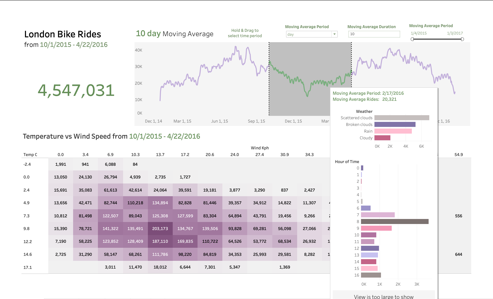

# City Biking Data Analysis Project

Hi!

In this project, I wanted to experience a solo front-to-end DS Analysis feature. I first used kaggle & pandas to ingest, clean, & analyze the raw data, then used Tableau to build a dashboard
with 5 tailorable features to visualize.

Feel free to check out the full interactive online version!: [TableauPublic](https://public.tableau.com/shared/9HRJH54NN?:display_count=n&:origin=viz_share_link)

-Ethan

